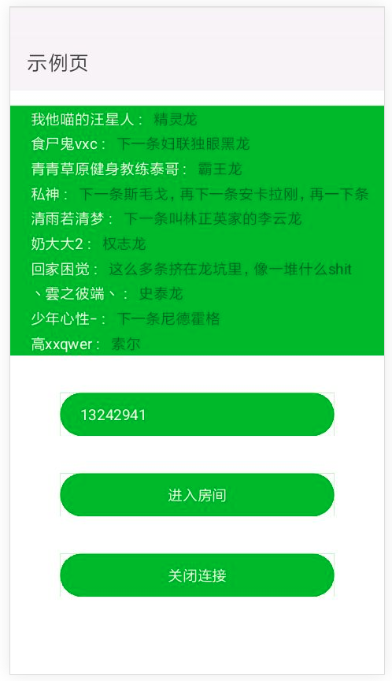

##### 快应用版本ws示例，通过扫码预览版查看。

[B站直播网址](https://live.bilibili.com/)

> 最新更新 => 通过进行nginx代理，通过我的域名转发到bilibili弹幕ws服务上，目前服务到期不再转发，开发者自行配置

> 导入 npm install -d qa-ws-bl
> 全局引用 QaWsBl  window.QaWsBl

> QaWsBl 对外暴露$destroy、$start、$subscribe三个API。

> 使用方式见example示例